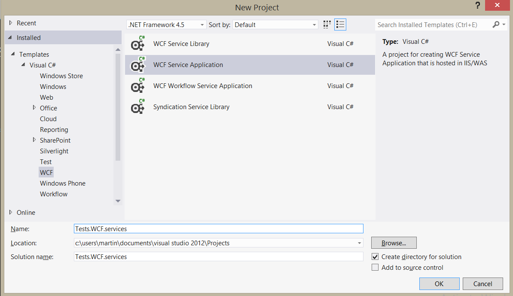
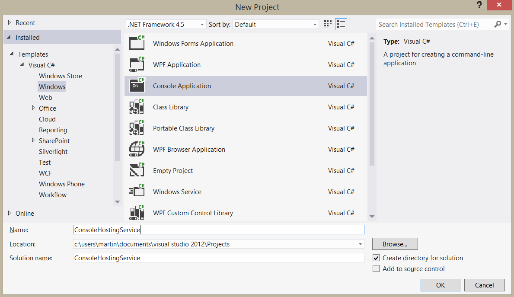
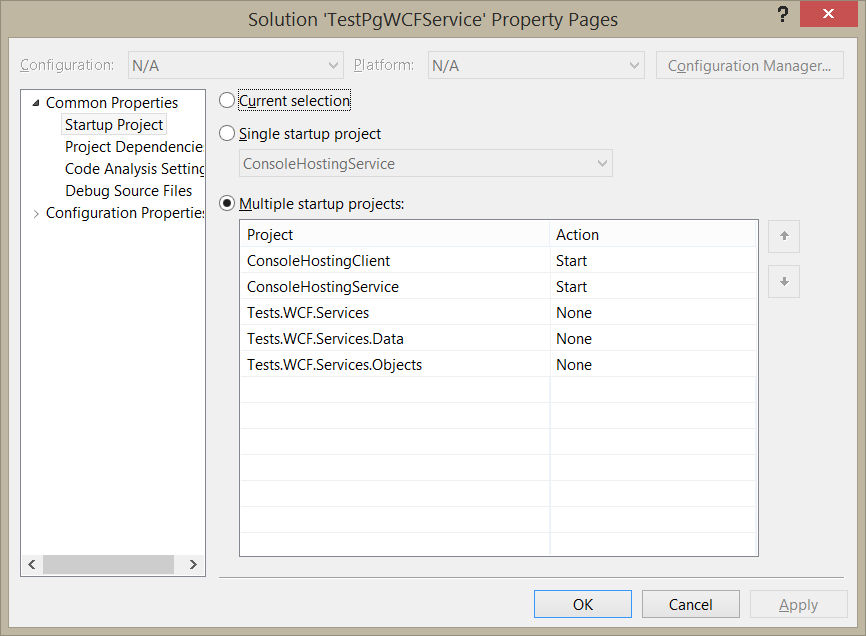
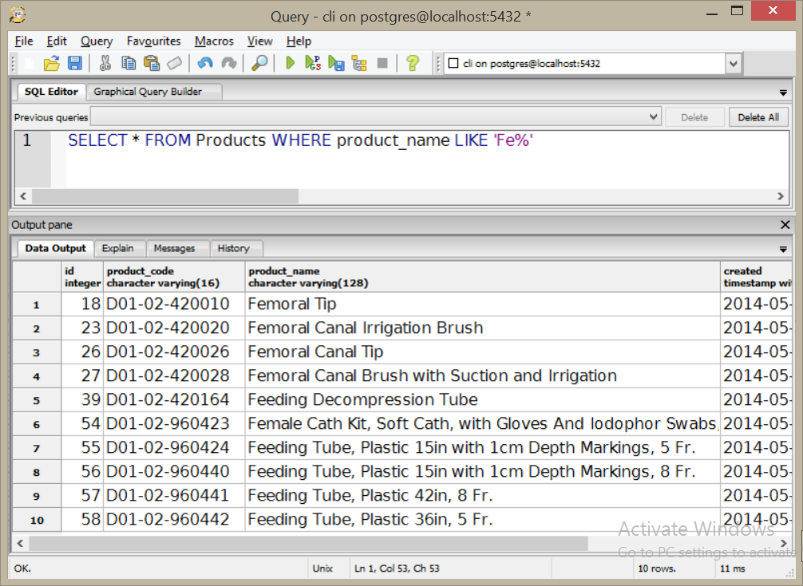
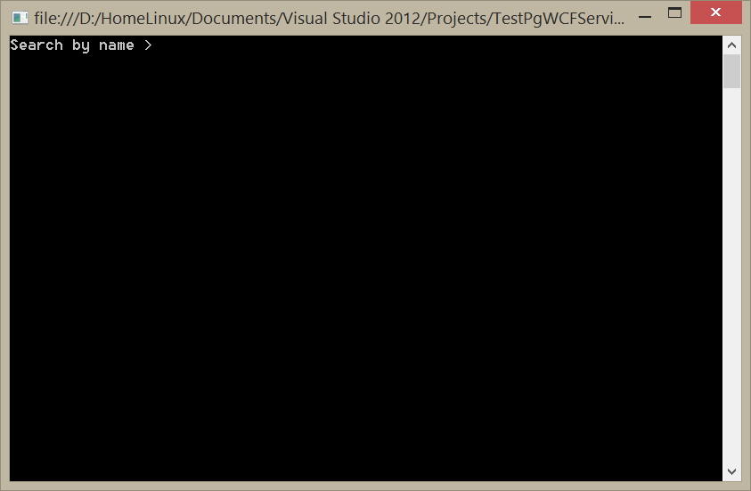
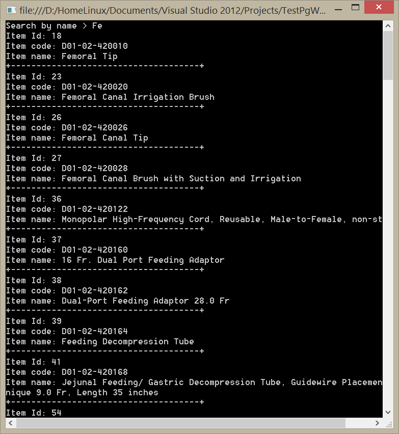

# Utilizando Self-hosting Windows Communication Foundation y PostgreSQL.
		

<b>Windows Communication Foundation</b>  es la parte del .NET Framework que define un modelo de programación común y una API unificada basada en estándares industriales de comunicación para construir aplicaciones distribuidas interoperables que se comunican entre sí mediante el intercambio de mensajes y así cubrir la mayor parte de los requerimientos en computación distribuida.

WCF incluye todas las tecnologías de comunicación abiertas como XML, SOAP y JSON y propietarias de Microsoft como MSMQ, COM+ y .NET Remoting.

Aunque en teoría se pueden construir servicios sin WCF, en la práctica utilizar WCF para construir servicios es mucho más práctico que hacerlo desde cero (start from scratch).

En resumen WCF consiste de un número de bibliotecas .NET que se utilizan para aplicaciones orientadas a servicios.

Antes de empezar con el ejemplo es importante tener claras algunas definiciones que son necesarias para entender el funcionamiento de WCF:
<ol>
<li><b>Endpoint:</b> En los sistemas orientados a servicios, es el lugar en donde los mensajes van y vienen cada endpoint requiere de tres elementos: Address, Binding y Contract. Pueden ser especificados de forma imperativa o declarativa.</li>
<li><b>Address:</b> En donde el servicio se encuentra disponible. Es un URL que se puede formar de 4 partes: Schema, machine, port y path.</li>
<li><b>Binding:</b> Como se puede acceder al servicio.</li>
<li><b>Contract:</b> Que operaciones ofrece el servicio.</li>
<li><b>Servicios:</b> Son procesos independientes definidos por su interfaz.</li>
<li><b>Componentes:</b> son los bloques de construcción a nivel plataforma tales como las bibliotecas (.dll) que se ensamblan en tiempo de diseño o en tiempo de ejecución.</li>
<li><b>Objetos:</b> Son los bloques de construcción del nivel más bajo que se encuentran dentro de los componentes y los servicios.</li>
</ol>

Hay que tener en cuenta que no importa que protocolo se use para el intercambio de mensajes desde las aplicaciones hasta el servicio, WCF siempre representará el mensaje como un objeto <i>Message.</i>

En resumen los servicios WCF son solo objetos que exponen una serie de operaciones que las aplicaciones clientes necesitan invocar. Cuando se construye un servicio se describen estas operaciones mediante un contrato (una interfaz) que debe tener una implementación (clase).

Para que el servicio esté disponible a los clientes se debe de instalar en un entorno de ejecución que hospede el servicio. Hay varias formas en las que puedes hospedar el servicio, puedes usar <i>Internet Information Services (IIS)</i>, <i>Windows Activation Services (WAS)</i> y <i>self-host managed applications</i> como una consola de windows o un servicio de Windows.

En el siguiente ejemplo mostraré como utilizar los plantillas de <b>Visual Studio</b> para construir una aplicación con la técnica de <b>self-hosting</b> en la cual el desarrollador es responsable de implementar y administrar el ciclo de vida del proceso de alojamiento.

Este ejemplo utiliza un servicio <b>WCF</b> que realiza la búsqueda del nombre de un producto en una tabla de productos dentro base de datos <b>postgreSQL.</b>

1-.Abrimos <b>Visual Studio</b> y en el explorador de soluciones agregamos un proyecto del tipo <b>WCF Service Library</b>.

2-. Nombramos este proyecto como: <b>Test.WCF.Services</b>

 

3-.A este proyecto le agregamos dos archivos: la interfaz <i>IProductsContract</i> y la clase <i>ProductsImplementation</i>.

En este código utilizamos unos ensamblados llamados <i>Tests.WCF.Services.Objects</i> y <i>Tests.WCF.Services.Data</i>  que contienen el código de datos y un <i>DTO</i>, este código lo omito en la explicación para centrarme en la construcción del WCF, sin embargo el proyecto completo lo incluyo en el código fuente de la solución.

4-. Agregamos un proyecto del tipo aplicación de consola a nuestra solución, con el nombre: <b>ConsoleHostingService</b>

 

5-. Utilizamos el código en la clase Program: 

Este código muestra la construcción de un <b>Self-Hosted Service</b> , en la línea siguiente creo el <b>Uniform Resource identifier</b> representado por la clase <a href="http://msdn.microsoft.com/en-us/library/vstudio/System.Uri(v=vs.110).aspx">URI</a>.

<pre>
 Uri baseAddress = new Uri("http://localhost:8004/");
</pre>

Después asigno el tipo de objeto de la implementación a una variable.

<pre>
 Type service = typeof(Tests.WCF.Services.ProductsImplementation);
</pre>

Ahora hago una instancia de la clase <b>ServiceHost</b> que es la clase que proporciona <b>WCF</b> para alojar <b>endpoints</b> de WCF en las aplicaciones .NET, una vez teniendo la instancia hay que decirle el tipo del servicio que debe inicializarse para recibir las peticiones así como establecerle el <b>endpoint</b> para que los cliente sepan donde enviar las peticiones.

<pre>
ServiceHost host = new ServiceHost(service, baseAddress);
</pre>

Bien ahora hay que invocar el método <tt>host.Open();</tt> para cargar el runtime de <b>WCF</b> y empezar a escuchar las peticiones.

<pre>
using (host)
      {
        Type contract = typeof(Tests.WCF.Services.IProductsContract);
        host.AddServiceEndpoint(contract, new WSHttpBinding(), "Products");
        host.Open();
        Console.WriteLine("Products service running.Press <ENTER> to quit.");
        Console.ReadLine();
        host.Close();
     }
</pre>

La flexibilidad de <b>self-hosting</b> aplica cuando las aplicaciones son <i>(in-proc)</i>, esto es que las aplicaciones están en el mismo proceso que el cliente.

Es importante que antes de ejecutar el programa cliente, se ejecute primero el programa que contiene el proceso <i>ServiceHost</i> esto lo podemos configurar en VS, en el submenú <i><b>Set Startup Projects</b></i> debajo del menú <i><b>Debug</b></i> en VS.

 

Aquí la búsqueda en la tabla utilizando el <i>Query Management</i> de <i>PgAdmin</i>

 

Ahora ejecutamos la misma búsqueda, solo que remotamente con la solución de VS, primero ejecutamos el proyecto <b>ConsoleHostingService</b>.

 

Inmediatamente después ejecutamos el proyecto <i>ConsoleHostingClient</i>.

 

Iniciamos con la búsqueda de productos, tecleamos la coincidencia a buscar y pulsamos ENTER, esto hará que se mande la petición al servicio WCF.

